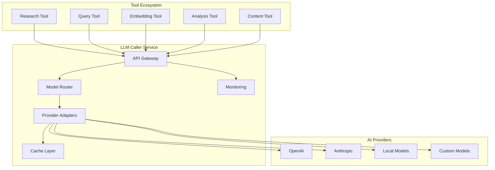

# LLM Caller Module - Vision Document

## Executive Summary

The LLM Caller module serves as the centralized AI inference service for our
modular tool ecosystem. By consolidating all Large Language Model interactions
into a single, well-architected service, we achieve operational excellence,
development velocity, and architectural consistency while maintaining the
independence and modularity of our tool design principles.

## Status snapshot (2025-09-27)

- Phase 1 foundation goals are complete and actively maintained.
- Phase 2/3 hardening items (observability polish, pilot integrations) remain
  in progress per the implementation roadmap.
- Later-phase intelligence and advanced features continue to live in the
  strategic backlog pending approvals.

## Vision Statement

**To provide a unified, high-performance, and extensible AI inference layer that
empowers all system modules with consistent, reliable, and cost-effective access
to diverse language models while maintaining operational transparency and
security.**

## Core Design Principles

### 1. Independent & Callable Tool Architecture

- **Service Contract**: Clean, well-defined API that any module can consume
- **Loose Coupling**: Tools depend on the LLM service interface, not
  implementation

- **Composability**: Multiple tools can orchestrate complex AI workflows through
  the service

### 2. Multi-Model & Multi-Provider Support

- **Model Agnostic**: Support for chat, completion, embedding, and specialized
  models

- **Provider Flexibility**: Seamless switching between OpenAI, Anthropic, local
  models, etc.

- **Future-Proof**: Plugin architecture for emerging model types and providers

### 3. Operational Excellence

- **Observability**: Comprehensive logging, metrics, and tracing for all AI
  interactions

- **Reliability**: Circuit breakers, retry logic, and graceful degradation
- **Cost Management**: Usage tracking, rate limiting, and budget controls

## Strategic Objectives

### Phase 1: Foundation (MVP)

- Unified API for chat completions and embeddings
- Support for 2-3 major providers (OpenAI, Anthropic, local)
- Basic retry logic and error handling
- Configuration management and API key security

### Phase 2: Production Ready

- Advanced rate limiting and cost controls
- Comprehensive monitoring and alerting
- Caching layer for performance optimization
- Streaming support for real-time applications

### Phase 3: Intelligence Layer

- Prompt engineering framework and templates
- Automatic model selection based on task requirements
- Fine-tuning integration and model lifecycle management
- Advanced analytics and usage optimization

## Architectural Overview



## Service Interface Design

### Core API Contract

```typescript
interface LLMService {
  // Chat/Completion Interface
  chat(request: ChatRequest): Promise<ChatResponse>
  chatStream(request: ChatRequest): AsyncIterable<ChatChunk>

  // Embedding Interface
  embed(request: EmbedRequest): Promise<EmbedResponse>

  // Batch Operations
  batchChat(requests: ChatRequest[]): Promise<ChatResponse[]>
  batchEmbed(requests: EmbedRequest[]): Promise<EmbedResponse[]>

  // Health & Status
  getHealth(): Promise<HealthStatus>
  getUsage(): Promise<UsageMetrics>
}
```

### Request Configuration

```typescript
interface ChatRequest {
  // Content
  messages: Message[]
  systemPrompt?: string

  // Model Selection
  model?: string
  provider?: string
  taskType?: 'research' | 'query' | 'analysis' | 'creative'

  // Generation Parameters
  temperature?: number
  maxTokens?: number
  topP?: number

  // Operational
  timeout?: number
  retryPolicy?: RetryConfig
  cacheKey?: string
  metadata?: Record<string, any>
}
```

## Key Capabilities

### 1. Intelligent Model Routing

- **Task-Based Selection**: Automatically choose optimal models for specific use
  cases

- **Cost Optimization**: Route to most cost-effective models that meet quality
  requirements

- **Load Balancing**: Distribute requests across providers to avoid rate limits
- **Fallback Chains**: Graceful degradation when primary models are unavailable

### 2. Performance Optimization

- **Smart Caching**: Cache responses based on semantic similarity and staleness
  tolerance

- **Connection Pooling**: Efficient HTTP connection management across providers
- **Batch Processing**: Aggregate multiple requests for batch-enabled providers
- **Streaming Support**: Real-time response streaming for interactive
  applications

### 3. Observability & Control

- **Request Tracing**: Full lifecycle tracking from request to response
- **Usage Analytics**: Detailed cost, latency, and quality metrics per tool/user
- **Error Monitoring**: Comprehensive error classification and alerting
- **Rate Limiting**: Per-tool, per-user, and global rate limiting controls

### 4. Security & Compliance

- **Credential Management**: Secure storage and rotation of API keys
- **Data Privacy**: Optional request/response encryption and PII filtering
- **Audit Logging**: Immutable logs for compliance and debugging
- **Access Controls**: Role-based access to different models and capabilities

## Integration Patterns

### Simple Query Pattern

```typescript
// Tool code
const response = await llmService.chat({
  messages: [{ role: 'user', content: userQuery }],
  taskType: 'query',
  maxTokens: 500
});
```

### Research Pattern

```typescript
// Tool code
const analysis = await llmService.chat({
  messages: buildResearchContext(documents),
  systemPrompt: 'You are a research analyst...',
  taskType: 'research',
  temperature: 0.1,
  cacheKey: `research:${documentsHash}`
});
```

### Embedding Pipeline Pattern

```typescript
// Tool code
const embeddings = await llmService.batchEmbed({
  texts: documentChunks,
  model: 'text-embedding-3-large',
  metadata: { source: 'knowledge_base' }
});
```

## Technical Implementation Strategy

### Technology Stack

- **Core Service**: Node.js/TypeScript or Python (FastAPI)
- **API Layer**: REST + WebSocket for streaming
- **Caching**: Redis for response caching
- **Monitoring**: Prometheus + Grafana
- **Configuration**: Environment-based with runtime updates

### Provider Adapter Pattern

```typescript
interface ProviderAdapter {
  name: string
  supportedModels: ModelCapability[]

  chat(request: NormalizedRequest): Promise<NormalizedResponse>
  embed(request: NormalizedRequest): Promise<NormalizedResponse>

  getHealth(): Promise<ProviderHealth>
  getCosts(): CostStructure
}
```

### Configuration Management

```yaml
# config/llm-service.yaml
providers:
  openai:
    apiKey: ${OPENAI_API_KEY}
    baseURL: "https://api.openai.com/v1"
    models:
      - name: "gpt-4"
        capabilities: ["chat", "analysis"]
        costPer1kTokens: 0.03

routing:
  taskTypes:
    research:
      preferredModels: ["gpt-4", "claude-3-opus"]
      fallbacks: ["gpt-3.5-turbo"]
    query:
      preferredModels: ["gpt-3.5-turbo", "claude-3-sonnet"]

caching:
  defaultTTL: 3600
  maxCacheSize: "1GB"

rateLimit:
  global: 1000/minute
  perTool: 100/minute
```

## Success Metrics

### Performance Indicators

- **Latency**: P95 response time < 2 seconds for standard requests
- **Availability**: 99.9% uptime with graceful degradation
- **Cost Efficiency**: 20% cost reduction through intelligent routing and
  caching

- **Cache Hit Rate**: >30% for repeated/similar queries

### Developer Experience

- **Integration Time**: New tools can integrate LLM capabilities in < 1 hour
- **Error Rate**: <1% of requests result in unhandled errors
- **Documentation Coverage**: 100% API coverage with examples
- **Support Response**: <24 hours for integration issues

### Operational Metrics

- **Cost Visibility**: Real-time cost tracking per tool/user/model
- **Usage Patterns**: Detailed analytics on model usage and performance
- **Error Classification**: Automatic categorization of failure modes
- **Capacity Planning**: Predictive scaling based on usage trends

## Risk Mitigation

### Technical Risks

- **Provider Outages**: Multi-provider fallback with circuit breakers
- **Rate Limiting**: Intelligent queuing and request distribution
- **Model Deprecation**: Automatic model version management and migration
- **Performance Degradation**: Real-time monitoring with automatic scaling

### Business Risks

- **Cost Overruns**: Budget alerts and automatic throttling
- **Vendor Lock-in**: Provider-agnostic architecture with easy migration
- **Compliance Issues**: Built-in audit logging and data governance
- **Security Breaches**: Encrypted communication and credential isolation

## Implementation Roadmap

### Quarter 1: Foundation

- [ ] Core service architecture and API design
- [ ] OpenAI and Anthropic provider adapters
- [ ] Basic authentication and configuration management
- [ ] Simple retry logic and error handling
- [ ] Initial monitoring and logging

### Quarter 2: Production Readiness

- [ ] Advanced rate limiting and cost controls
- [ ] Response caching with Redis
- [ ] Streaming support for real-time applications
- [ ] Comprehensive test suite and CI/CD pipeline
- [ ] Production deployment and monitoring

### Quarter 3: Intelligence & Optimization

- [ ] Intelligent model routing based on task requirements
- [ ] Prompt template framework and management
- [ ] Advanced analytics and usage optimization
- [ ] Local model support and fine-tuning integration
- [ ] Performance optimization and scaling

### Quarter 4: Advanced Features

- [ ] Semantic caching with vector similarity
- [ ] Multi-modal support (vision, audio, etc.)
- [ ] Workflow orchestration for complex AI tasks
- [ ] Advanced security features and compliance tools
- [ ] Plugin ecosystem for custom extensions

## Conclusion

The LLM Caller module represents a strategic investment in our AI infrastructure
that will pay dividends across our entire tool ecosystem. By centralizing AI
interactions while maintaining modular independence, we create a foundation for
rapid innovation, operational excellence, and sustainable growth.

This vision document serves as our north star for building an AI service that
not only meets today's requirements but positions us for the rapidly evolving
landscape of artificial intelligence applications.

---

**Document Status**: Draft v1.0
**Last Updated**: 2025-09-18
**Next Review**: 2025-10-18
**Owner**: AI Solution Architecture Team
**Stakeholders**: Development Team, Operations Team, Product Team
