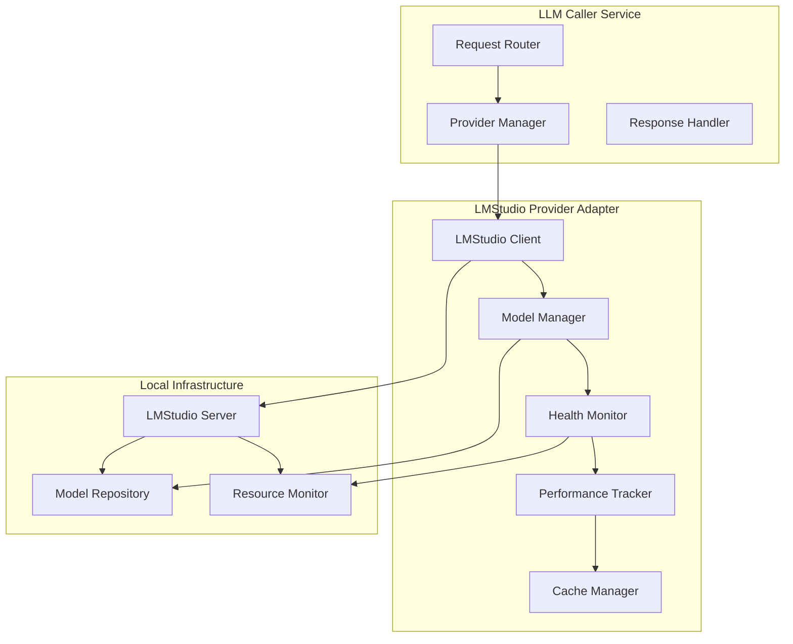

# LMStudio Provider Adapter Architecture

## Overview

The LMStudio Provider Adapter serves as the bridge between our LLM Caller
service and locally running LMStudio instances, providing seamless integration
with local AI models while maintaining the same interface as cloud providers.

## Architecture Design

### Core Components



## Provider Adapter Interface

### Core Interface Implementation

```typescript
interface LMStudioProvider extends ProviderAdapter {
  name: 'lmstudio'

  // Core Methods
  chat(request: ChatRequest): Promise<ChatResponse>
  chatStream(request: ChatRequest): AsyncIterable<ChatChunk>
  embed(request: EmbedRequest): Promise<EmbedResponse>

  // Management Methods
  getAvailableModels(): Promise<ModelInfo[]>
  getHealth(): Promise<ProviderHealth>
  getPerformanceMetrics(): Promise<PerformanceMetrics>

  // Local-Specific Methods
  loadModel(modelName: string): Promise<boolean>
  unloadModel(modelName: string): Promise<boolean>
  getResourceUsage(): Promise<ResourceMetrics>
}
```

### Configuration Schema

```typescript
interface LMStudioConfig {
  // Connection Settings
  baseUrl: string           // Default: 'http://localhost:1234/v1'
  timeout: number          // Default: 30000ms
  retryAttempts: number    // Default: 3
  retryDelay: number       // Default: 1000ms

  // Model Management
  autoLoadModels: boolean  // Auto-load models on demand
  keepModelsWarm: string[] // Models to keep loaded
  maxConcurrentRequests: number // Default: 5

  // Performance
  enableCaching: boolean   // Local response caching
  cacheSize: string       // Default: '1GB'
  cacheTTL: number        // Default: 3600s

  // Monitoring
  collectMetrics: boolean  // Performance tracking
  healthCheckInterval: number // Default: 30000ms
}
```

## Model Management System

### Model Discovery and Capability Mapping

```typescript
interface ModelCapabilities {
  modelName: string
  provider: 'lmstudio'

  // Technical Specs
  parameterCount: number
  quantization: string
  memoryRequirement: number
  maxContextLength: number

  // Capabilities
  supportedTasks: TaskType[]
  performanceScores: {
    coding: number
    research: number
    creative: number
    analysis: number
    general: number
  }

  // Resource Requirements
  minMemoryGB: number
  preferredGPU: boolean
  estimatedLatency: {
    [taskType: string]: number
  }
}
```

### Model Capability Database

```typescript
const MODEL_CAPABILITIES: Record<string, ModelCapabilities> = {
  'deepseek-coder-34b': {
    modelName: 'deepseek-coder-34b',
    provider: 'lmstudio',
    parameterCount: 34_000_000_000,
    quantization: 'Q4_K_M',
    memoryRequirement: 20,
    maxContextLength: 32768,
    supportedTasks: ['coding', 'analysis', 'research'],
    performanceScores: {
      coding: 95,
      research: 75,
      creative: 60,
      analysis: 85,
      general: 70
    },
    minMemoryGB: 20,
    preferredGPU: true,
    estimatedLatency: {
      coding: 1200,
      analysis: 1500,
      research: 2000
    }
  },

  'llama-3-70b': {
    modelName: 'llama-3-70b',
    provider: 'lmstudio',
    parameterCount: 70_000_000_000,
    quantization: 'Q4_K_M',
    memoryRequirement: 40,
    maxContextLength: 8192,
    supportedTasks: ['research', 'creative', 'analysis', 'general'],
    performanceScores: {
      coding: 80,
      research: 95,
      creative: 95,
      analysis: 90,
      general: 90
    },
    minMemoryGB: 40,
    preferredGPU: true,
    estimatedLatency: {
      research: 2500,
      creative: 2000,
      analysis: 2200
    }
  },

  'phi-3-mini': {
    modelName: 'phi-3-mini',
    provider: 'lmstudio',
    parameterCount: 3_800_000_000,
    quantization: 'Q4_K_M',
    memoryRequirement: 3,
    maxContextLength: 4096,
    supportedTasks: ['general', 'coding', 'analysis'],
    performanceScores: {
      coding: 70,
      research: 65,
      creative: 60,
      analysis: 75,
      general: 80
    },
    minMemoryGB: 3,
    preferredGPU: false,
    estimatedLatency: {
      general: 500,
      coding: 600,
      analysis: 700
    }
  }
}
```

## Intelligent Routing System

### Task Classification Engine

```typescript
class TaskClassifier {
  classifyRequest(request: ChatRequest): TaskClassification {
    const content = request.messages.map(m => m.content).join(' ')

    // Keyword-based classification
    const patterns = {
      coding: /\b(code|function|class|variable|debug|implement|programming)\b/i,
      research: /\b(analyze|research|study|investigate|compare|evaluate)\b/i,
      creative: /\b(write|story|creative|imagine|generate|compose)\b/i,
      analysis: /\b(data|chart|analyze|interpret|calculate|process)\b/i
    }

    const scores = Object.entries(patterns).map(([task, pattern]) => ({
      task: task as TaskType,
      score: (content.match(pattern) || []).length
    }))

    const topTask = scores.reduce((max, current) =>
      current.score > max.score ? current : max
    )

    return {
      primaryTask: topTask.task,
      confidence: Math.min(topTask.score * 0.2, 1.0),
      secondaryTasks: scores
        .filter(s => s.task !== topTask.task && s.score > 0)
        .map(s => s.task)
    }
  }
}
```

### Model Selection Algorithm

```typescript
class ModelSelector {
  selectOptimalModel(
    request: ChatRequest,
    availableModels: ModelCapabilities[]
  ): ModelSelection {

    const classification = this.taskClassifier.classifyRequest(request)
    const systemResources = this.resourceMonitor.getCurrentUsage()

    // Filter models by capability and resources
    const candidates = availableModels.filter(model => {
      return (
        model.supportedTasks.includes(classification.primaryTask) &&
        model.minMemoryGB <= systemResources.availableMemoryGB &&
        this.isModelLoaded(model.modelName)
      )
    })

    if (candidates.length === 0) {
      return this.selectFallbackModel(request, availableModels)
    }

    // Score models based on performance and resource efficiency
    const scoredModels = candidates.map(model => ({
      model,
      score: this.calculateModelScore(model, classification, systemResources)
    }))

    scoredModels.sort((a, b) => b.score - a.score)

    return {
      selectedModel: scoredModels[0].model,
      alternatives: scoredModels.slice(1, 3).map(s => s.model),
      reasoning: this.generateSelectionReasoning(
        scoredModels[0],
        classification
      )
    }
  }

  private calculateModelScore(
    model: ModelCapabilities,
    classification: TaskClassification,
    resources: ResourceMetrics
  ): number {

    // Performance score for the primary task
    const performanceScore = model.performanceScores[classification.primaryTask] || 50

    // Resource efficiency score
    const memoryEfficiency = Math.max(0,
      (resources.availableMemoryGB - model.minMemoryGB) / resources.availableMemoryGB
    )

    // Latency preference (lower is better)
    const expectedLatency = model.estimatedLatency[classification.primaryTask] || 3000
    const latencyScore = Math.max(0, (5000 - expectedLatency) / 5000)

    // Model availability bonus
    const availabilityBonus = this.isModelLoaded(model.modelName) ? 20 : 0

    return (
      performanceScore * 0.4 +
      memoryEfficiency * 100 * 0.3 +
      latencyScore * 100 * 0.2 +
      availabilityBonus * 0.1
    )
  }
}
```

## Performance Optimization

### Connection Management

```typescript
class LMStudioClient {
  private connectionPool: Map<string, HttpClient> = new Map()
  private requestQueue: RequestQueue = new RequestQueue()

  async makeRequest(request: APIRequest): Promise<APIResponse> {
    const client = this.getOrCreateConnection(request.modelName)

    // Queue management for concurrent requests
    return this.requestQueue.execute(async () => {
      try {
        const response = await client.post(request.endpoint, request.data)
        this.updatePerformanceMetrics(request, response)
        return response
      } catch (error) {
        this.handleRequestError(error, request)
        throw error
      }
    })
  }

  private getOrCreateConnection(modelName: string): HttpClient {
    if (!this.connectionPool.has(modelName)) {
      const client = new HttpClient({
        baseURL: this.config.baseUrl,
        timeout: this.config.timeout,
        keepAlive: true,
        maxSockets: 5
      })
      this.connectionPool.set(modelName, client)
    }
    return this.connectionPool.get(modelName)!
  }
}
```

### Smart Caching System

```typescript
class LocalCacheManager {
  private cache: Map<string, CacheEntry> = new Map()
  private persistentCache: FileCache

  async get(key: string): Promise<CacheEntry | null> {
    // Check in-memory cache first
    const memoryEntry = this.cache.get(key)
    if (memoryEntry && !this.isExpired(memoryEntry)) {
      return memoryEntry
    }

    // Check persistent cache
    const persistentEntry = await this.persistentCache.get(key)
    if (persistentEntry && !this.isExpired(persistentEntry)) {
      // Promote to memory cache
      this.cache.set(key, persistentEntry)
      return persistentEntry
    }

    return null
  }

  generateCacheKey(request: ChatRequest): string {
    // Create semantic hash including messages and key parameters
    const content = {
      messages: request.messages,
      temperature: request.temperature || 0.7,
      maxTokens: request.maxTokens,
      model: request.model
    }

    return this.hashObject(content)
  }

  async set(key: string, response: ChatResponse, ttl?: number): Promise<void> {
    const entry: CacheEntry = {
      data: response,
      timestamp: Date.now(),
      ttl: ttl || this.config.cacheTTL,
      accessCount: 0
    }

    // Store in memory
    this.cache.set(key, entry)

    // Store persistently if valuable
    if (this.shouldPersist(entry)) {
      await this.persistentCache.set(key, entry)
    }
  }
}
```

## Health Monitoring and Diagnostics

### Health Check System

```typescript
class LMStudioHealthMonitor {
  private healthStatus: ProviderHealth = {
    status: 'unknown',
    lastCheck: 0,
    responseTime: 0,
    availableModels: [],
    resourceUsage: {}
  }

  async performHealthCheck(): Promise<ProviderHealth> {
    const startTime = Date.now()

    try {
      // Check server connectivity
      const modelsResponse = await this.client.getModels()
      const responseTime = Date.now() - startTime

      // Check resource usage
      const resourceUsage = await this.getResourceUsage()

      // Test a simple completion
      const testCompletion = await this.performTestCompletion()

      this.healthStatus = {
        status: 'healthy',
        lastCheck: Date.now(),
        responseTime,
        availableModels: modelsResponse.data,
        resourceUsage,
        testCompletion: testCompletion.success,
        errors: []
      }

    } catch (error) {
      this.healthStatus = {
        status: 'unhealthy',
        lastCheck: Date.now(),
        responseTime: Date.now() - startTime,
        availableModels: [],
        resourceUsage: {},
        errors: [error.message]
      }
    }

    return this.healthStatus
  }

  private async performTestCompletion(): Promise<{ success: boolean }> {
    try {
      const response = await this.client.chat({
        messages: [{ role: 'user', content: 'Hello' }],
        maxTokens: 10,
        temperature: 0
      })

      return { success: response.choices.length > 0 }
    } catch (error) {
      return { success: false }
    }
  }
}
```

## Error Handling and Resilience

### Fallback Strategies

```typescript
class FallbackManager {
  async handleModelUnavailable(
    request: ChatRequest,
    unavailableModel: string
  ): Promise<ChatResponse> {

    // Try alternative local models
    const alternatives = this.getAlternativeModels(unavailableModel)

    for (const altModel of alternatives) {
      if (await this.isModelAvailable(altModel)) {
        request.model = altModel
        return this.executeRequest(request)
      }
    }

    // Fallback to cloud provider if configured
    if (this.config.enableCloudFallback) {
      return this.cloudFallbackProvider.chat(request)
    }

    throw new ModelUnavailableError(
      `No suitable models available for request. Tried: ${unavailableModel}, ${alternatives.join(', ')}`
    )
  }

  private getAlternativeModels(primaryModel: string): string[] {
    const modelCaps = MODEL_CAPABILITIES[primaryModel]
    if (!modelCaps) return []

    // Find models with similar capabilities
    return Object.values(MODEL_CAPABILITIES)
      .filter(model =>
        model.modelName !== primaryModel &&
        model.supportedTasks.some(task =>
          modelCaps.supportedTasks.includes(task)
        )
      )
      .sort((a, b) => {
        // Prefer models with similar parameter counts
        const aDiff = Math.abs(a.parameterCount - modelCaps.parameterCount)
        const bDiff = Math.abs(b.parameterCount - modelCaps.parameterCount)
        return aDiff - bDiff
      })
      .map(model => model.modelName)
      .slice(0, 3)
  }
}
```

## Integration Points

### Provider Registration

```typescript
// Register the LMStudio provider with the main service
const lmstudioProvider = new LMStudioProvider({
  baseUrl: process.env.LMSTUDIO_URL || 'http://localhost:1234/v1',
  enableCaching: true,
  autoLoadModels: true,
  enableCloudFallback: true
})

await providerManager.registerProvider('lmstudio', lmstudioProvider)
```

### Request Flow Integration

```typescript
// The provider fits seamlessly into the existing request flow
const response = await llmService.chat({
  messages: [{ role: 'user', content: 'Write a Python function' }],
  taskType: 'coding',
  preferredProvider: 'lmstudio', // Optional: prefer local
  fallbackToCloud: true // Fallback if local unavailable
})
```

This architecture ensures that LMStudio integration maintains the same interface
as cloud providers while providing local-specific optimizations and intelligent
model management.
